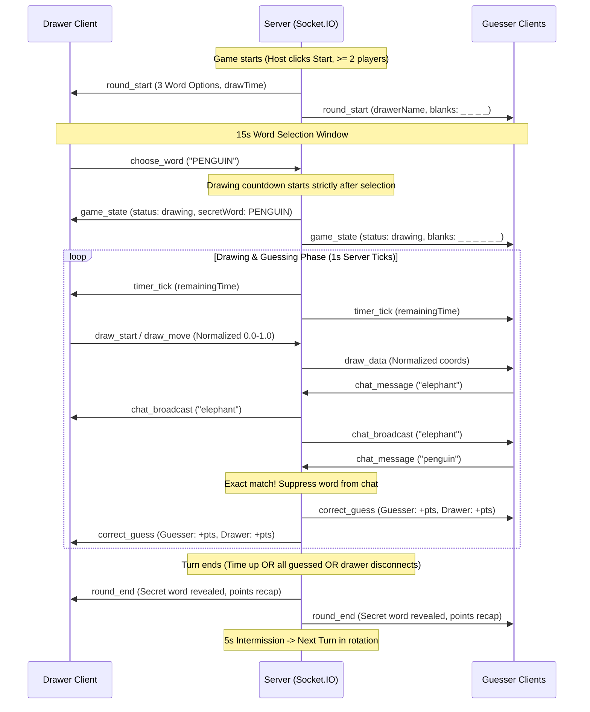

# skribbl.io Clone — Real-Time Multiplayer Drawing & Guessing Game

An end-to-end, browser-based real-time multiplayer drawing and guessing game modeled after [skribbl.io](https://skribbl.io/). Built with **React 19**, **TypeScript**, **Vite**, **Node.js**, **Express**, and **Socket.IO**.

---

## Table of Contents

1. [Project Overview & Problem Statement](#1-project-overview--problem-statement)
2. [Features, Scope & Requirements (PRD/SRS Summary)](#2-features-scope--requirements-prdsrs-summary)
3. [Technology Stack](#3-technology-stack)
4. [High-Level Design (HLD): Architecture & Communication Flow](#4-high-level-design-hld-architecture--communication-flow)
5. [Low-Level Design (LLD): Modules, Models, Timers & Validation](#5-low-level-design-lld-modules-models-timers--validation)
6. [API & Socket.IO Event Summary](#6-api--socketio-event-summary)
7. [Implementation Overview](#7-implementation-overview)
8. [Installation & Local Run Commands](#8-installation--local-run-commands)
9. [Testing Instructions & Verified Results](#9-testing-instructions--verified-results)
10. [Deployment Guide: Split Vercel + Render Deployment & Dashboard Settings](#10-deployment-guide-split-vercel--render-deployment--dashboard-settings)
11. [Operations Notes & Known Limitations](#11-operations-notes--known-limitations)
12. [Additional Documentation Index](#12-additional-documentation-index)
13. [License](#13-license)

---

## 1. Project Overview & Problem Statement

### Overview
This project provides a full-stack, browser-based multiplayer party game where players gather in shared rooms to draw chosen words while other players guess in real time to earn points on a dynamic leaderboard. It supports instant 1-click public matchmaking as well as private rooms configured with custom room codes and direct URL invite links.

### Problem Statement
Real-time multiplayer drawing games present several engineering challenges:
1. **State Desynchronization & Coordinate Distortion:** Rendering strokes across heterogeneous client viewports (desktops, laptops, tablets, phones) can lead to coordinate drift, clipping, or visual distortion if raw pixel values are broadcast.
2. **Cheating & Chat Word Spoiling:** In casual guessing games, a correct guess typed into public chat immediately ruins the round for everyone else. Furthermore, client-side secret word inspection in browser developer tools or network payloads must be prevented.
3. **Turn Lifecycle Race Conditions:** Socket event arrival during component transitions (e.g. entering game from lobby, advancing turns) often results in missed events, missing word selection modals, or out-of-sync countdown timers.
4. **Name Ambiguity & Impersonation:** When players enter identical or overlapping nicknames, confusion arises across the lobby, chat, and scoring boards. Renumbering remaining players when someone leaves disrupts player identity during active games.
5. **Deployment & WebSocket Instability:** Separate client and server deployments often encounter cross-origin CORS barriers, SSL handshake mismatches, and WebSocket proxy disconnects on cloud hosting platforms.

### Solution
The application solves these problems through:
* **Server-Authoritative State Machine:** All timers, turn sequences, word selections, score math, and room states originate strictly on the Node.js server.
* **Normalized Float Coordinates ($0.0 \dots 1.0$):** Canvas strokes and flood fills are transmitted as relative ratios, guaranteeing pixel-perfect proportional rendering across all display resolutions.
* **Drawer-Only Canvas Authority & Synchronized History:** Drawing actions (brush strokes, fills, undo, clear) are strictly validated on the server. Freehand strokes and flood fills share a unified action history replayed deterministically via `draw_sync`.
* **Anti-Spoiler Chat Shield & Word Protection:** Plaintext secret words are never transmitted to guesser clients. Correct guesses are suppressed from public chat, replaced with system announcements, and subsequent messages from that player are shielded from players who have not yet deduced the word.
* **Persistent Event Router:** Persistent Socket.IO listeners at the root application coordinator eliminate React lifecycle race conditions.
* **Room-Scoped Duplicate Name Numbering:** Stable join-order suffix numbering (`Alice 1`, `Alice 2`, `Alice 3`) that remains permanent across player departures without renumbering.
* **Split Production Deployment:** Global static Edge distribution on Vercel paired with a persistent Node.js/Express + Socket.IO backend on Render, with strict CORS protection via `CLIENT_ORIGINS` (and optional unified single-port local hosting).

---

## 2. Features, Scope & Requirements (PRD/SRS Summary)

### Room Management & Matchmaking
* **1-Click Public Matchmaking:** Automatically routes players into the oldest available public room with open slots (`players.size < maxPlayers`). If all public rooms are full or none exist, a new public room is automatically initialized.
* **Private Room Codes & Links:** Private rooms are excluded from public matchmaking. Players join via a 6-character alphanumeric code or a direct URL link: `/?room=CODE`.
* **Configurable Room Settings:** Hosts can adjust game parameters within server-enforced boundaries:
  * **Max Players:** 2 to 20 players (default: 8).
  * **Rounds:** 2 to 10 rounds (default: 3).
  * **Draw Time:** 15 to 240 seconds (default: 80s).
  * **Word Choices:** 1 to 5 choices presented to the drawer (default: 3).
  * **Hints:** 0 to 5 progressive letter reveals (default: 2; 0 disables hints).
* **Strict 2-Player Minimum Gate:** Matches cannot start with fewer than 2 connected players. The server validates room capacity and rejects single-player starts with `INSUFFICIENT_PLAYERS`.
* **Dynamic Host Migration:** If the room host disconnects, host authority transfers automatically to the next oldest connected player.
* **Room-Scoped Duplicate Name Numbering & Disambiguation:**
  * Unique names display normally without numbers.
  * When nicknames match after trimming and case-insensitive comparison, suffixes are assigned in join order (`Alice 1`, `Alice 2`, `Alice 3`).
  * Assigned numbers remain strictly stable when players leave; remaining players are never renumbered. Subsequent arrivals receive the next sequential number (`Alice 4`).
  * Inputs already containing numbers or colliding with active display names are disambiguated so that no two active players in a room share a display name (e.g., entering `Alice 4` when `Alice 4` is already active yields `Alice 4 2`).
  * Display names are assigned strictly on the server and render identically across lobby rosters, drawer status banners, chat feeds, system notifications, scores, and leaderboards, while unique socket IDs remain the sole authority for permissions and scoring.

### Real-Time Drawing Canvas
* **Normalized Coordinates ($0.0 \dots 1.0$):** All drawing and fill coordinates $(x, y)$ are normalized to float ratios between $0.0$ and $1.0$ relative to canvas width and height, guaranteeing pixel-perfect rendering across different viewport sizes and devices.
* **Drawer Status Banner:** `"[Player] is drawing"` banner is displayed above the canvas for all participants.
* **Drawer Toolkit:** 16 curated palette colors, 4 brush thicknesses (3px, 8px, 16px, 30px), Brush tool, Fill / Paint Bucket tool, Eraser tool, Undo action, and Clear Canvas. Tools and interactive cursor states are active exclusively for the designated drawer; guessers receive a read-only canvas with disabled toolbar controls.
* **Fill / Paint Bucket Tool (Flood Fill):**
  * **Algorithm:** High-performance, non-recursive 4-way stack flood fill operating directly on 2D canvas `ImageData` using packed 32-bit integers, preventing call stack overflow.
  * **Outline Preservation:** Applies a color tolerance threshold (32) so closed shape outlines and anti-aliased stroke borders are preserved without bleed-through or white halo artifacts.
  * **Open Area Handling:** Floods unclosed shapes and open canvas areas cleanly to canvas boundaries. Duplicate clicks on identical colors are safely short-circuited as no-ops.
* **Drawer-Only Access & Server Authorization:**
  * All canvas actions (`draw_start`, `draw_move`, `draw_end`, `draw_fill`, `draw_undo`, `canvas_clear`) are validated strictly on the server against `socket.id === game.activeDrawerId` during the `drawing` phase.
  * Unauthorized attempts by non-drawers emit a `NOT_DRAWER` error (*"Only the active drawer can modify the canvas."*).
* **Multiplayer Synchronization & Mid-Round Join Sync:**
  * Real-time `draw_fill` broadcasts transmit normalized float coordinates and target hex color to all other clients in the room.
  * Players who join or reconnect during an active drawing round immediately receive `draw_sync` with the complete sequence of strokes and fills, replayed in order to mirror current canvas state.
* **Unified Undo History:**
  * Freehand strokes and paint bucket fills are recorded as first-class actions in `DrawingState`.
  * Emitting `draw_undo` pops the most recent action (brush stroke or fill) and broadcasts `draw_sync`, deterministically re-rendering the canvas across all room clients.

### Word Selection & Progressive Hints
* **Curated Word Bank:** Embedded offline dictionary containing ~300 common, easy-to-draw English nouns.
* **15-Second Selection Window:** At turn start, 3 random words are sent strictly to the active drawer socket. Guessers wait on a dedicated waiting screen displaying a 15-second selection countdown ticker.
* **Automatic Selection Fallback:** If the drawer does not click a word within 15 seconds, the server auto-selects Word #1.
* **Synchronized Drawing Countdown:** The drawing timer begins strictly after word selection completes.
* **Secret Word Secrecy:** Plaintext words are never transmitted to guessers over WebSockets. Guessers receive masked underscores (`_ _ _ _`).
* **Progressive Timed Hints:** Letter reveals occur at 50% elapsed turn time (Hint 1) and 75% elapsed turn time (Hint 2), revealing up to at most half of the total letters.

### Chat, Guessing & Anti-Spoiler Shield
* **Unified Input:** A single text field handles both casual chat messages and word guesses.
* **Drawer Restrictions:** Active drawers are strictly prevented from chatting or submitting guesses in both UI and on the server during their turn (`DRAWER_CANNOT_GUESS`).
* **Exact Match Evaluation:** Case-insensitive, trimmed comparison against the secret word.
* **Anti-Spoiler Shield:** Correct guesses are suppressed from public chat. The server broadcasts a green announcement (`"[Player] guessed the word!"`) and shields that player's subsequent messages from players who have not yet guessed.
* **Near-Miss Feedback:** If a guess is within a 2-character Levenshtein edit distance for words $\ge 4$ letters, the sender receives a private notice: *"'{guess}' is very close!"*.

### Time-Based Scoring & Leaderboard
* **Authoritative Server Math:** Scores are calculated based on the ratio of remaining time to total turn duration:
  $$\text{ratio} = \frac{t_{\text{remaining}}}{t_{\text{duration}}}$$
  * **Guesser Points:** $100 + \lfloor 400 \times \text{ratio} \rfloor$ (Range: 100 to 500 pts).
  * **Drawer Points:** $25 + \lfloor 100 \times \text{ratio} \rfloor$ awarded per successful guesser (Range: 25 to 125 pts).
  * **Expired Guesses:** Submissions when $t_{\text{remaining}} \le 0$ receive 0 points.
* **Live Leaderboard & Podium:** Real-time scoreboard with round recap and final 1st, 2nd, and 3rd place podium. The host can click **Play Again** to reset scores and return all players to the lobby.

### UI & Audio Feedback
* **Professional Understated Interface:** Clean dark layout (`#0f1115` / `#16181d`), subtle blue accents (`#2563eb`), accessible typography (`Inter`), high contrast, visible keyboard focus indicators (`:focus-visible`), and zero decorative clutter.
* **Native Web Audio Join Cues:** 140ms synthesized chime generated via browser Web Audio API when another player joins, respecting autoplay policies via passive user-gesture unlocking, with an accessible Sound On/Off toggle persisted in `localStorage`.

---

## 3. Technology Stack

| Layer | Technology | Version | Purpose |
| :--- | :--- | :--- | :--- |
| **Monorepo** | npm workspaces | v9+ / v10+ | Multi-package workspace management (`shared`, `client`, `server`) |
| **Frontend UI** | React | v19.0.0 | Component rendering, hooks, and reactive UI state |
| **Language** | TypeScript | v5.7.0 | Static typing across frontend, backend, and shared contracts |
| **Build Tool** | Vite | v6.4.4 | Fast client bundling, HMR dev server, and production compilation |
| **Canvas** | HTML5 Canvas API | Native Web API | Real-time stroke capturing and 2D rendering with normalized scaling |
| **Audio** | Web Audio API | Native Web API | Zero-dependency synthesized audio chime for room join events |
| **Backend** | Node.js & Express | v18+ / v4.21.2 | HTTP server, REST endpoints (`/health`), and static bundle hosting |
| **Real-Time** | Socket.IO | v4.8.1 | Low-latency bidirectional WebSocket gateway and room multiplexing |
| **Styling** | Vanilla CSS | CSS3 | Custom property design system, accessible contrast, responsive layout |
| **Deployment** | Vercel & Render | Cloud Platform | Split architecture: Vercel frontend SPA + Render persistent Node.js backend (with optional unified mode) |

---

## 4. High-Level Design (HLD): Architecture & Communication Flow

### System Architecture
The application runs as a cohesive client-server system organized around server-authoritative state management:```text
┌────────────────────────────────────────────────────────────────────────┐
│               Frontend: Browser Client on Vercel (React 19)            │
│  ├── App.tsx: Persistent Socket Router & Event Coordinator             │
│  ├── Canvas.tsx: 2D Canvas Engine (Normalized Coordinates [0.0 - 1.0]) │
│  ├── Chat.tsx: Chat Feed & Anti-Spoiler Guess Input                    │
│  └── Sound: Native Web Audio Chime & Autoplay Gesture Unlock           │
└───────────────────────────────────▲────────────────────────────────────┘
                                    │
    Cross-Origin WebSocket (Socket.IO v4 via VITE_BACKEND_URL)
    & HTTP REST (/health) protected by CLIENT_ORIGINS CORS
                                    │
┌───────────────────────────────────▼────────────────────────────────────┐
│              Backend: Node.js Express Server on Render                 │
│                                                                        │
│  ┌──────────────────────────────────────────────────────────────────┐  │
│  │ Express HTTP Layer                                               │  │
│  │  ├── GET /health (Authoritative health probe & CORS check)       │  │
│  │  ├── CORS Middleware (Restricted to exact CLIENT_ORIGINS)        │  │
│  │  └── Static Fallback (Optional unified mode when serving dist)   │  │
│  └──────────────────────────────────────────────────────────────────┘  │
│                                                                        │
│  ┌──────────────────────────────────────────────────────────────────┐  │
│  │ Socket.IO Gateway & Event Handlers                               │  │
│  │  ├── roomHandler.ts (Matchmaking, Room Creation, Settings)       │  │
│  │  ├── drawHandler.ts (Normalized Stroke & Fill Sync, Undo, Clear) │  │
│  │  └── chatHandler.ts (Guess Evaluation, Anti-Spoiler Filtering)   │  │
│  └──────────────────────────────────────────────────────────────────┘  │
│                                                                        │
│  ┌──────────────────────────────────────────────────────────────────┐  │
│  │ Domain State Machines & Services                                 │  │
│  │  ├── RoomManager: In-memory room registry and 30s cleanup timer  │  │
│  │  ├── Room: Room lifecycle & duplicate name disambiguation engine │  │
│  │  ├── Game: Turn rotation, 15s selection, 1s draw timer, scoring  │  │
│  │  └── WordService: ~300 curated English word dictionary           │  │
│  └──────────────────────────────────────────────────────────────────┘  │
└────────────────────────────────────────────────────────────────────────┘
```

### Communication Topology
* **Cross-Origin Socket.IO Connection:** In production split deployment, the browser client connects directly to the Render backend origin (`VITE_BACKEND_URL`). The backend validates incoming origins against `CLIENT_ORIGINS`.
* **Room-Isolated Sockets:** Each active match maps to a Socket.IO room channel: `socket.join(room_${roomId})`. All gameplay events, chat messages, and canvas strokes broadcast strictly within that channel.
* **Normalized Data Transport:** Drawing strokes and flood fills are broadcast as float coordinates ($0.0 \dots 1.0$), ensuring viewers on any device scale them to their local canvas dimensions without coordinate drift.

### End-to-End Game Turn Flow


---

## 5. Low-Level Design (LLD): Modules, Models, Timers & Validation

### Codebase Organization
```text
skribbl-clone/
├── shared/                      # @skribbl/shared contract package
│   ├── types.ts                 # Authoritative DTOs, interfaces, constraints
│   ├── events.ts                # Authoritative Socket.IO event name constants
│   └── index.ts                 # Barrel exports
├── server/                      # @skribbl/server Node.js backend
│   └── src/
│       ├── server.ts            # Express setup, static serving, Socket.IO binding
│       ├── models/
│       │   ├── Player.ts        # Player entity, rawName, assigned numbering
│       │   ├── Room.ts          # Room entity, name disambiguation, settings sanitization
│       │   ├── Game.ts          # Turn rotation, word selection, hints, clocks, scoring
│       │   └── DrawingState.ts  # In-memory stroke & fill buffer, undo, clear
│       ├── services/
│       │   ├── RoomManager.ts   # In-memory room lookup and 30s cleanup timer
│       │   └── WordService.ts   # 300-word bank, random selection logic
│       ├── handlers/
│       │   ├── roomHandler.ts   # Room creation, joining, ready toggles, game start, mid-round sync
│       │   ├── drawHandler.ts   # Normalized stroke & fill broadcasts, undo, clear
│       │   └── chatHandler.ts   # Guess evaluation, anti-spoiler shielding
│       ├── data/
│       │   └── words.json       # 300 curated English drawing words
│       └── utils/
│           └── levenshtein.ts   # Levenshtein distance for close guesses
└── client/                      # @skribbl/client React frontend
    └── src/
        ├── App.tsx              # Root coordinator & persistent socket router
        ├── components/
        │   ├── Landing.tsx      # Public matchmaking, create room, join private
        │   ├── Lobby.tsx        # Player roster, settings sliders, host start
        │   ├── GameView.tsx     # Game screen container & phase manager
        │   ├── Canvas.tsx       # HTML5 canvas drawing engine & flood fill integration
        │   ├── Toolbar.tsx      # 16 colors, 4 sizes, Brush, Fill bucket, Eraser, Undo, Clear
        │   ├── Chat.tsx         # Chat feed, guess input, anti-spoiler notices
        │   ├── WordSelection.tsx# Drawer choice modal (3 words) & guesser waiting screen
        │   └── Scoreboard.tsx   # Live rankings, round recap, podium celebration
        ├── hooks/
        │   └── useSocket.ts     # Socket.IO connection manager & transport state
        └── utils/
            ├── coordinates.ts   # Normalized float coordinate scaling [0.0 - 1.0]
            ├── floodFill.ts     # 4-way stack-based flood fill with outline preservation
            └── sound.ts         # Native Web Audio join chime & autoplay unlock
```

### Core Domain Entities

#### 1. Player (`server/src/models/Player.ts`)
```typescript
export class Player {
  public id: string;                    // Unique player ID (socket.id / UUID)
  public socketId: string;              // Active Socket.IO connection ID
  public rawName: string;               // Original nickname entered by user
  public name: string;                  // Authoritative display name (e.g. "Alice 1")
  public assignedNumber: number | null; // Suffix number if duplicates exist
  public isSuffixed: boolean;           // Permanent lock flag ensuring stability
  public score: number = 0;             // Cumulative score across match
  public isHost: boolean = false;       // Host permission flag
  public hasGuessed: boolean = false;   // Correct guess flag for current turn
  public isReady: boolean = false;      // Lobby ready state
}
```

#### 2. Room (`server/src/models/Room.ts`)
```typescript
export class Room {
  public id: string;                    // Internal room ID (e.g. room_179137...)
  public code: string;                  // 6-character code (e.g. "X8K2M1")
  public isPublic: boolean;             // Public matchmaking flag
  public settings: RoomSettings;        // Clamped room settings
  public players: Map<string, Player>;  // Connected players keyed by id
  public hostId: string;                // Current host player id
  public status: RoomStatus;            // 'lobby' | 'word_selecting' | 'drawing' | 'round_end' | 'game_over'
  public game: Game | null;             // Active Game instance
  private rawNameCounters: Map<string, number>; // Next suffix number per raw name
}
```

#### 3. Game (`server/src/models/Game.ts`)
```typescript
export class Game {
  public room: Room;
  public io: Server;
  public currentRound: number = 1;
  public totalRounds: number = 3;
  public drawerOrder: string[] = [];    // Monotonic player ID rotation list
  public drawerIndex: number = 0;       // Current turn index
  public activeDrawerId: string | null;
  public currentWordOptions: string[];  // Words offered to drawer (drawer only)
  public secretWord: string = '';       // Active secret word
  public revealedIndices: Set<number>;  // Indices revealed via hints
  public remainingTime: number = 0;     // Authoritative turn countdown in seconds
  public timer: NodeJS.Timeout | null;  // 1-second drawing timer
  public wordSelectionTimer: NodeJS.Timeout | null; // 15-second selection timer
  public intermissionTimer: NodeJS.Timeout | null;  // 5-second intermission timer
  public drawingState: DrawingState;    // In-memory stroke & fill buffer
  public guessedPlayerIds: Set<string>; // Players who guessed correctly this turn
  public roundPoints: Record<string, number>; // Points earned in active turn
}
```

#### 4. DrawingState (`server/src/models/DrawingState.ts`)
```typescript
export class DrawingState {
  private strokes: Stroke[] = [];         // Sequential history of freehand strokes and flood fills
  private currentStroke: Stroke | null;   // Active freehand stroke in progress

  public startStroke(x: number, y: number, color: string, size: number): Stroke;
  public addPoint(x: number, y: number): void;
  public endStroke(): void;
  public addFill(x: number, y: number, color: string): Stroke;
  public undo(): Stroke[];                // Pops the most recent action (stroke or fill)
  public clear(): void;                   // Resets the canvas history
  public getStrokes(): Stroke[];          // Returns immutable snapshot of canvas history
}
```

### Game Phases & Lifecycle Transitions
| Phase | Trigger | Server Actions | Client View |
| :--- | :--- | :--- | :--- |
| **`lobby`** | Room created / joined | Players join, host toggles settings, players ready. Validates $\ge 2$ players before starting. | Lobby view with player roster, settings sliders, and Start button. |
| **`word_selecting`** | Host clicks Start / Previous turn concludes | Selects 3 words from word bank. Sends words strictly to drawer socket. Starts 15s countdown. | Drawer sees 3-word selection modal. Guessers see waiting screen with live countdown ticker. |
| **`drawing`** | Drawer selects word / 15s timer expires | Secret word locked. Masks word (`_ _ _ _`). Starts authoritative draw countdown (e.g. 80s). | Drawer gets canvas tools; guessers see masked blanks and view-only canvas. Drawer banner displayed. |
| **`round_end`** | Timer reaches 0 / All guessers succeed / Drawer disconnects | Secret word revealed to all. Calculates and broadcasts turn score recap. Starts 5s intermission timer. | Turn recap banner showing revealed secret word and earned points. |
| **`game_over`** | All configured rounds completed | Computes final ranked leaderboard. Determines 1st, 2nd, and 3rd place winners. | Winner podium celebrating top 3. Host sees **Play Again** button to return room to lobby. |

### Authoritative Clocks & Timers
1. **Word Selection Timer (15 Seconds):** Ticks once per second. If drawer does not pick before timer reaches 0, the server automatically selects Word #1.
2. **Drawing Countdown Timer (15–240 Seconds, Default 80s):** Begins strictly after word selection completes. Emits `timer_tick` every 1000ms. At 50% elapsed time, Hint 1 reveals a letter; at 75% elapsed time, Hint 2 reveals a second letter.
3. **Round Intermission Timer (5 Seconds):** Delays turn progression by 5 seconds to allow players to review the revealed secret word and points breakdown.
4. **Room Cleanup Timer (30 Seconds):** When the last player leaves a room (`players.size === 0`), a 30-second timer begins. If no player rejoins within 30 seconds, the room is deleted from memory.

### Authoritative Scoring Implementation
Scores are computed deterministically on the server when a guesser submits a correct guess:
$$\text{ratio} = \frac{t_{\text{remaining}}}{t_{\text{duration}}}$$
* **Guesser Score:** $\text{Guesser Points} = 100 + \lfloor 400 \times \text{ratio} \rfloor$
  * Max points: 500 (instant guess at $t = t_{\text{duration}}$).
  * Min points: 100 (last-second guess at $t = 1$).
  * Expired guesses ($t_{\text{remaining}} \le 0$): 0 points (rejected).
  * Awarded once per eligible guesser per turn.
* **Drawer Score:** $\text{Drawer Points} = 25 + \lfloor 100 \times \text{ratio} \rfloor$
  * Awarded in real time once per eligible guesser who identifies the word.
  * Max points per guesser: 125.
  * Min points per guesser: 25.

### Server Validation & Security Boundaries
1. **Settings Clamping:** Clamped via `Room.sanitizeSettings` to enforce valid ranges ($2 \le \text{maxPlayers} \le 20$, $2 \le \text{rounds} \le 10$, $15 \le \text{drawTime} \le 240$, $1 \le \text{wordCount} \le 5$, $0 \le \text{hints} \le 5$).
2. **Minimum 2-Player Requirement:** Host cannot start the match alone (`players.size >= 2`).
3. **Duplicate Name Sanitization & Stability:**
   * Handled by `Room.updatePlayerDisplayNames(player)`.
   * When trimmed, case-insensitive names match in a room, suffixes are assigned in join order (`Alice 1`, `Alice 2`, `Alice 3`).
   * Once suffixed, `isSuffixed = true` ensures numbers remain permanent when earlier players leave (no renumbering).
   * Copycat inputs matching an active display name are disambiguated with the next available suffix.
4. **Drawing Authorization & History Integrity:**
   * All canvas packets (`draw_start`, `draw_move`, `draw_end`, `draw_fill`, `draw_undo`, `canvas_clear`) are validated strictly on the server against `socket.id === game.activeDrawerId` during the `drawing` phase.
   * Unauthorized attempts by non-drawers emit `NOT_DRAWER` error (*"Only the active drawer can modify the canvas."*).
   * Fills and strokes are tracked in `DrawingState`; undo operations pop the latest action and broadcast `draw_sync` to all clients, and mid-round joining players receive `draw_sync` to reconstruct the canvas.
5. **Drawer Chat & Guess Restriction:** Active drawer is blocked from chatting and submitting guesses (`DRAWER_CANNOT_GUESS`).
6. **Anti-Spoiler Chat Shield:** Correct guesses are suppressed from public chat, broadcasting `"{Player} guessed the word!"` in green and shielding that player's subsequent messages from players who have not yet guessed.
7. **Near-Miss Feedback:** Calculated via Levenshtein distance for words $\ge 4$ characters. If edit distance is $\le 2$, a private message (*"'{guess}' is very close!"*) is returned.

---

## 6. API & Socket.IO Event Summary

### HTTP REST Endpoints
* **`GET /health`**: Healthcheck endpoint returning service health and uptime:
  ```json
  {
    "status": "ok",
    "uptime": 257.04,
    "timestamp": "2026-10-07T12:33:08.745Z"
  }
  ```
* **`GET /*`**: Serves compiled React production bundle from `client/dist` with SPA fallback.

### Socket.IO Event Dictionary
| Event Name | Direction | Payload Interface | Description |
| :--- | :--- | :--- | :--- |
| `create_room` | Client $\rightarrow$ Server | `CreateRoomPayload` | Creates a new room (Public or Private) with custom settings. |
| `join_room` | Client $\rightarrow$ Server | `JoinRoomPayload` | Joins an existing room using a 6-character room code or ID. |
| `join_public` | Client $\rightarrow$ Server | `JoinPublicPayload` | Matches player into the oldest available open public room. |
| `leave_room` | Client $\rightarrow$ Server | `LeaveRoomPayload` | Explicitly leaves the current room. |
| `update_settings`| Client $\rightarrow$ Server | `UpdateSettingsPayload` | Host updates configurable room settings. |
| `set_ready` | Client $\rightarrow$ Server | `SetReadyPayload` | Player toggles their ready status in the lobby. |
| `start_game` | Client $\rightarrow$ Server | `StartGamePayload` | Host starts the game (requires $\ge 2$ connected players). |
| `choose_word` | Client $\rightarrow$ Server | `ChooseWordPayload` | Active drawer submits their chosen secret word. |
| `draw_start` | Bidirectional | `DrawStartPayload` | Initiates a canvas stroke with normalized $(x, y)$, color, size. |
| `draw_move` | Bidirectional | `DrawMovePayload` | Appends a normalized coordinate point to the active stroke. |
| `draw_end` | Bidirectional | `DrawEndPayload` | Concludes the active canvas stroke. |
| `draw_fill` | Bidirectional | `DrawFillPayload` | Broadcasts normalized fill coordinates $(x, y)$ and target color across room clients. |
| `draw_undo` | Bidirectional | `DrawUndoPayload` | Removes the drawer's previous action (stroke or fill) across all clients. |
| `canvas_clear` | Bidirectional | `CanvasClearPayload` | Wipes the entire canvas across all clients. |
| `chat_message` | Client $\rightarrow$ Server | `ChatInputPayload` | Submits a chat message or guess attempt. |
| `play_again` | Client $\rightarrow$ Server | `PlayAgainPayload` | Host resets the game back to the lobby with scores zeroed. |
| `room_state` | Server $\rightarrow$ Client | `RoomStatePayload` | Full room state broadcast (players, host, settings, status). |
| `player_joined` | Server $\rightarrow$ Client | `PlayerJoinedPayload` | Emitted when a new player connects (triggers join chime). |
| `player_left` | Server $\rightarrow$ Client | `PlayerLeftPayload` | Emitted when a player leaves or disconnects. |
| `round_start` | Server $\rightarrow$ Client | `RoundStartPayload` | Starts turn. Delivers word options strictly to drawer socket. |
| `timer_tick` | Server $\rightarrow$ Client | `TimerTickPayload` | 1-second authoritative countdown tick. |
| `hint_revealed` | Server $\rightarrow$ Client | `HintRevealedPayload` | Broadcasts progressive letter reveals for guessers. |
| `draw_data` | Server $\rightarrow$ Client | `DrawDataPayload` | Broadcasts normalized stroke data to guesser canvases. |
| `draw_sync` | Server $\rightarrow$ Client | `DrawSyncPayload` | Replays full canvas history (strokes and fills) on undo or mid-round player join. |
| `chat_broadcast`| Server $\rightarrow$ Client | `ChatMessagePayload` | Broadcasts chat message or system announcement. |
| `correct_guess` | Server $\rightarrow$ Client | `CorrectGuessPayload` | Broadcasts that a player guessed the word with points earned. |
| `round_end` | Server $\rightarrow$ Client | `RoundEndPayload` | Concludes turn, reveals secret word, and details points recap. |
| `game_over` | Server $\rightarrow$ Client | `GameOverPayload` | Concludes game, broadcasts final podium and leaderboard. |
| `error` | Server $\rightarrow$ Client | `ErrorPayload` | Emits structured error code and message. |

---

## 7. Implementation Overview

### Key Engineering Decisions
1. **Server-Authoritative Paradigm:** Clients never calculate points, advance turns, decrement clocks, or validate guesses. The server runs authoritative timers and broadcasts state events.
2. **Normalized Floating-Point Coordinates:** Capturing canvas strokes as ratios between $0.0$ and $1.0$ guarantees that drawings made on large desktop monitors render identically on mobile screens without coordinate drift or clipping.
3. **Decoupled Socket Event Coordination:** Maintaining persistent Socket.IO listeners at the root `App.tsx` level eliminates race conditions between socket event delivery and React child component mount lifecycles.
4. **Secret Word Confidentiality:** Plaintext secret words are only transmitted to the active drawer socket during `round_start` and in `GameStatePayload.wordOptions`. Guesser payloads contain only masked blanks (`_ _ _ _`).
5. **Anti-Spoiler Chat Shield:** Submitting the secret word suppresses the message text from public chat, broadcasts a green announcement, and hides subsequent messages from that player from un-guessed players.
6. **Room-Scoped Duplicate Name Numbering:** Disambiguates duplicate nicknames with stable join-order suffixes (`Alice 1`, `Alice 2`, `Alice 3`) that remain unchanged when players depart.
7. **Native Web Audio Chimes:** Join chimes are synthesized directly in the browser using the Web Audio API (`AudioContext`), eliminating external audio asset requests and respecting browser autoplay gesture policies.
8. **Canvas Flood Fill & Unified Action History:** Implements a high-performance, non-recursive 4-way stack flood fill with outline tolerance on canvas `ImageData`. Freehand strokes and paint fills are tracked as first-class actions in `DrawingState`, supporting drawer authorization, normalized cross-device sync, mid-round join synchronization, and deterministic undo.

---

## 8. Installation & Local Run Commands

### Prerequisites
* **Node.js:** v18.0.0 or higher
* **npm:** v9.0.0 or higher

### Installation
Clone the repository and install all workspace dependencies:
```bash
git clone https://github.com/Megxeter/skribble-clone.git
cd skribbl-clone
npm install
```

### Building Packages
```bash
# Build frontend only (builds shared dependency first, outputs to client/dist)
npm run build:frontend

# Build backend only (builds shared dependency first, outputs to server/dist)
npm run build:backend

# Full monorepo build (builds shared, client, and server)
npm run build
```

### Running Locally

#### Mode 1: Production Mode (Unified Single Port)
Compiles all packages and starts the Express production server serving both the static frontend and Socket.IO on port 3000:
```bash
# Compile shared types, Vite client bundle, and server TypeScript
npm run build

# Start the unified production server
npm run start
```
* **Application URL:** [http://localhost:3000](http://localhost:3000)
* **Healthcheck Probe:** [http://localhost:3000/health](http://localhost:3000/health)

#### Mode 2: Development Mode (Hot Module Replacement)
Runs the server and Vite client concurrently with hot reloading:
```bash
npm run dev
```
* **Frontend Dev Server (Vite HMR):** `http://localhost:5173` (proxies `/socket.io` and `/health` to backend)
* **Backend Server (Express + Socket.IO):** `http://localhost:3000`

---

## 9. Testing Instructions & Verified Results

### Automated Test Suites
The codebase includes multi-client automated test scripts executing realistic multi-player scenarios:

```bash
# 1. Cross-origin CORS headers, allowed/disallowed origins, and Socket.IO connectivity
npm run test:cors

# 2. Room-scoped duplicate name numbering, departure stability, and room isolation
npm run test:names

# 3. Word selection flow, timing synchronization, and Play Again lobby reset
npm run test:flow

# 4. Player join toast notifications, audio chime contracts, and duplicate suppression
npm run test:join

# 5. Milestone 1: Healthcheck, static bundle serving, and basic Socket.IO connectivity
npm run test:m1

# 6. Milestone 2: Multi-client matchmaking, private codes, room limits, and host migration
npm run test:m2

# 7. Milestone 3: Canvas drawing sync, normalized coordinates, turn rotation, and hints
npm run test:m3

# 8. Milestone 4: Chat guessing, time-based scoring formulas, anti-spoiler shield, and podium
npm run test:m4

# 9. Canvas Fill / Paint Bucket tool flood fill algorithm, server authority, and undo sync
npm run test:fill
```

### Verified Test Results Summary
| Test Suite | Scope & Scenarios Verified | Verified Result |
| :--- | :--- | :--- |
| `test:cors` | Validates cross-origin GET `/health` endpoint with allowed origin (CORS headers confirmed), rejection of unauthorized origins, and cross-origin Socket.IO bidirectional connection. | **PASSED** |
| `test:names` | Validates unique names (`Alice`), join-order duplicate suffixes (`Alice 1`, `alice 2`, `ALICE 3`), stable non-renumbering upon departure, new arrivals receiving next number (`Alice 4`), copycat number disambiguation (`Alice 4 2`), room isolation, and display name consistency across chat. | **PASSED** |
| `test:flow` | Validates word selection choices sent strictly to drawer socket, guessers on waiting screen, 15s selection countdown, drawing countdown starting only after selection, later turn rotations, and Play Again lobby reset. | **PASSED** |
| `test:join` | Validates `player_joined` event emitted once per actual join, audio chime contracts, and suppression on setting updates or ready toggles. | **PASSED** |
| `test:m1` | Validates `/health` endpoint, static client asset serving, and Socket.IO bidirectional connection. | **PASSED** |
| `test:m2` | Validates public matchmaking, private room codes, setting bounds, host migration on disconnect, and minimum 2-player start gate. | **PASSED** |
| `test:m3` | Validates real-time canvas stroke sync, normalized coordinates, drawer tool exclusivity, undo last stroke, canvas clear, and timed letter hints. | **PASSED** |
| `test:m4` | Validates server-side guess matching, time-based score formula calculation, drawer point awards, anti-spoiler chat shield, and game-over podium. | **PASSED** |
| `test:fill` | Validates unit tests for 4-way flood fill algorithm, closed outline preservation, open area boundary filling, redundant fill no-ops, server `NOT_DRAWER` authorization, multiplayer `draw_fill` sync, and undo popping fills from history. | **PASSED** |
| `npm run build` | Compiles `@skribbl/shared`, bundles `@skribbl/client` into `client/dist`, and transpiles `@skribbl/server` into `server/dist`. | **PASSED (0 Errors)** |

---

## 10. Deployment Guide: Split Vercel + Render Deployment & Dashboard Settings

The production deployment uses a **split deployment architecture**:
1. **Frontend on Vercel:** Static React 19 single-page application served via Vercel's global Edge CDN, utilizing client-side routing configured in [`vercel.json`](vercel.json).
2. **Backend on Render:** Persistent Node.js/Express web service managing long-lived Socket.IO WebSockets, in-memory room lifecycle (`RoomManager`), game timers, word masking, scoring math, and authoritative validation.

> **Note:** Deployment configuration and cross-origin communication scripts are fully implemented and verified locally. The service is ready for deployment following the steps below. (No live URLs are active yet).

```text
[ Browser Player ] ──(HTTPS: Static Assets & HTML)──► [ Vercel Edge Network ]
        │
        └──────(WSS/HTTPS: WebSockets & /health)─────► [ Render Node Backend ]
                (Origin checked against CLIENT_ORIGINS)
```

---

### Step-by-Step Deployment Instructions

#### Step 1: Deploy Backend on Render
Deploy the persistent backend first so you have its HTTPS origin for the frontend configuration:

1. Push this repository to your GitHub account.
2. In the [Render Dashboard](https://dashboard.render.com/), click **New + > Web Service**.
3. Connect your GitHub repository and enter these exact settings:

| Setting | Value | Notes |
| :--- | :--- | :--- |
| **Name** | `skribbl-clone-backend` | Or any unique service name |
| **Region** | Any preferred region | e.g. Frankfurt, Oregon, Ohio |
| **Branch** | `main` | Production branch |
| **Root Directory** | *(leave blank / repository root)* | Root of the monorepo |
| **Runtime** | `Node` | Node.js environment |
| **Build Command** | `npm ci && npm run build:backend` | Installs dependencies and compiles shared + server |
| **Start Command** | `npm start` | Runs `node server/dist/server.js` |
| **Health Check Path**| `/health` | Render polls this endpoint for availability |
| **Plan Type** | `Free` | Standard free web service |

4. In the **Environment Variables** section on Render, add:
   * **`NODE_ENV`**: `production`
   * **`CLIENT_ORIGINS`**: Set to `*` initially during first boot, or set directly to your expected Vercel URL (e.g. `https://<your-project>.vercel.app,http://localhost:5173`).
   *(Note: `PORT` is automatically injected by Render's infrastructure; the server binds to `process.env.PORT` automatically).*
5. Click **Create Web Service**. Wait for the build and deployment to succeed.
6. Copy your assigned Render HTTPS URL (e.g. `https://skribbl-clone-backend.onrender.com`).

---

#### Step 2: Deploy Frontend on Vercel
Now deploy the client SPA on Vercel, pointing it to the live Render backend:

1. In the [Vercel Dashboard](https://vercel.com/dashboard), click **Add New... > Project**.
2. Import your GitHub repository.
3. Configure the exact project settings:

| Setting | Value | Notes |
| :--- | :--- | :--- |
| **Framework Preset** | `Vite` | Detected automatically or select Vite |
| **Root Directory** | `./` | Monorepo repository root |
| **Install Command** | `npm ci` | Installs monorepo workspace dependencies |
| **Build Command** | `npm run build:frontend` | Compiles `@skribbl/shared` first, then bundles `@skribbl/client` |
| **Output Directory** | `client/dist` | Directory containing compiled static assets |

4. Under **Environment Variables**, add:
   * **`VITE_BACKEND_URL`**: `https://<your-backend-name>.onrender.com` *(The exact HTTPS origin of your Render backend copied from Step 1, without trailing slash).*
5. Click **Deploy**. Vercel will install dependencies, build the shared package, compile the frontend bundle with the backend URL configured, and deploy to your Vercel URL (e.g. `https://<your-project>.vercel.app`).

---

#### Step 3: Lock Down CORS on Render
Once your Vercel deployment completes and you have the final frontend domain:

1. Return to the [Render Dashboard](https://dashboard.render.com/) and navigate to your `skribbl-clone-backend` service.
2. Go to **Environment** settings.
3. Update **`CLIENT_ORIGINS`** to contain your exact production frontend origin and local dev URL:
   ```text
   CLIENT_ORIGINS=https://<your-project>.vercel.app,http://localhost:5173
   ```
4. Click **Save Changes**. Render will automatically restart the service with the restricted CORS policy.

---

### Key Architectural Configurations

#### 1. SPA Routing vs Socket.IO Separation
* **[`vercel.json`](vercel.json)** configures client-side SPA routing by rewriting all URL paths (`/(.*)`) to `/index.html`:
  ```json
  {
    "$schema": "https://openapi.vercel.sh/vercel.json",
    "installCommand": "npm ci",
    "buildCommand": "npm run build:frontend",
    "outputDirectory": "client/dist",
    "rewrites": [
      {
        "source": "/(.*)",
        "destination": "/index.html"
      }
    ]
  }
  ```
* **No Socket.IO Routing through Vercel:** Vercel serves only static client bundles. WebSockets and backend HTTP calls are never proxied or routed through Vercel serverless functions. The browser client opens a direct persistent WebSocket connection to the Render backend via `VITE_BACKEND_URL`.
* **Frontend Invitation Links:** Invitation links are generated via `window.location.origin` (e.g. `https://<your-project>.vercel.app/?room=ABC123`). They remain strictly on the frontend domain and automatically populate the room code on arrival.

#### 2. Blueprint Deployment (`render.yaml`)
Alternatively, deploy the backend via Render Blueprint using the included [`render.yaml`](render.yaml):
```yaml
services:
  - type: web
    name: skribbl-clone-backend
    env: node
    plan: free
    buildCommand: npm ci && npm run build:backend
    startCommand: npm start
    healthCheckPath: /health
    envVars:
      - key: NODE_ENV
        value: production
      - key: CLIENT_ORIGINS
        sync: false
```

#### 3. Optional Unified Local / Self-Hosted Mode
When `VITE_BACKEND_URL` is omitted or unset, the application seamlessly preserves the single-port unified deployment topology:
* `npm run build` compiles shared contracts, frontend assets to `client/dist`, and the backend server.
* `npm start` serves the static bundle from `client/dist` and mounts Socket.IO on the same HTTP port (`http://localhost:3000`), with zero cross-origin configuration required.

---

## 11. Operations Notes & Known Limitations

1. **Free-Tier Sleeping Backend Delays (Cold Starts):**
   * On Render's free tier, services spin down into sleep mode after 15 minutes of inactivity.
   * When a player first visits the Vercel frontend, the browser initiates a connection that triggers a cold start on Render. Waking the backend typically takes **30 to 60+ seconds**.
   * The client application handles this gracefully:
     * Socket.IO is configured with `reconnectionAttempts: Infinity` and exponential backoff, retrying continuously until the backend wakes.
     * The Landing page displays a clear status banner: `Connecting to game server... If waking from free-tier sleep, this may take 30–60 seconds.`
     * The footer status indicator pulses amber: `Connecting to server (waking backend)...`.
     * Join and create room buttons remain guarded until the connection is established, automatically unlocking once connected.
2. **Ephemeral In-Memory Room State:**
   * Rooms, active games, player rosters, and canvas histories reside entirely in Node.js server memory (`RoomManager`).
   * Empty rooms are automatically pruned after 30 seconds of inactivity.
   * Because state is held in memory, any backend server restart, manual redeploy, or free-tier sleep cycle resets active rooms and disconnects ongoing matches. Players in disconnected rooms simply need to re-create or re-join rooms.
3. **Single-Instance Scaling Ceiling:**
   * The server runs as a single Node.js process. Scaling horizontally across multiple server instances would require an external pub/sub store (such as a Redis adapter for Socket.IO) to synchronize room events across instances.
4. **Guest Nicknames (No Persistent Database):**
   * Players join instantly with nicknames without accounts, passwords, or database storage. Nicknames are scoped to each room and disambiguated with stable join-order numbers.
5. **Embedded Word Bank:**
   * Word selection draws from a curated built-in dictionary of ~300 common English nouns; custom word list imports are out of scope for this release.
6. **Browser Audio Autoplay Policy:**
   * In compliance with browser autoplay restrictions, player join audio chimes activate after the player's first interaction with the page (e.g. clicking Join or Create Room). Sound can be muted at any time via the footer sound toggle.

---

## 12. Additional Documentation Index

For deeper specifications and technical design records, refer to the documentation in [`docs/`](docs/):

* [docs/hld.md](docs/hld.md) — **High-Level Design (HLD)**: Architecture diagrams, Socket.IO communication topology, room state machines, and unified Render deployment structure.
* [docs/lld.md](docs/lld.md) — **Low-Level Design (LLD)**: Code modules, data models (`Player`, `Room`, `Game`, `DrawingState`), WebSocket event payloads, authoritative timers, scoring formulas, and server-side validation rules.
* [docs/architecture.md](docs/architecture.md) — System architecture overview and core design invariants.
* [docs/socket-events.md](docs/socket-events.md) — Exhaustive Socket.IO event dictionary, payload interfaces, and protocol contracts.
* [docs/game-rules.md](docs/game-rules.md) — Detailed game rules, configurable ranges, turn rotation, and scoring math.
* [docs/decisions.md](docs/decisions.md) — Architecture decisions, design rationale, and technical considerations.

---

## 13. License

MIT License. See [LICENSE](LICENSE) for details.
