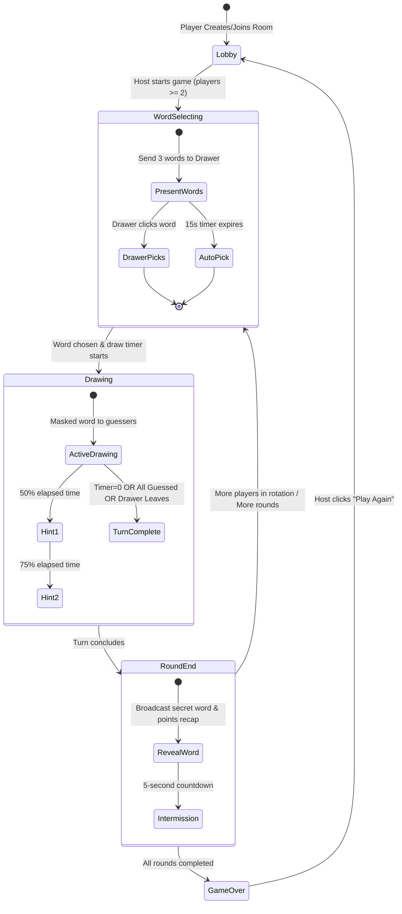

# Low-Level Design (LLD) — skribbl.io Clone

## 1. Module Architecture & Codebase Layout

The project codebase is organized into modular packages:

```text
skribbl-clone/
├── shared/                      # Workspace: @skribbl/shared
│   ├── types.ts                 # Authoritative DTOs, payload schemas, constraints
│   ├── events.ts                # WebSocket event constant definitions
│   └── index.ts                 # Barrel exports
│
├── server/                      # Workspace: @skribbl/server
│   └── src/
│       ├── server.ts            # Express setup, static hosting, Socket.IO binding
│       ├── models/
│       │   ├── Player.ts        # Player entity, rawName, assigned numbering
│       │   ├── Room.ts          # Room entity, name disambiguation, settings sanitization
│       │   ├── Game.ts          # Turn rotation, word selection, hints, scoring, clocks
│       │   └── DrawingState.ts  # In-memory stroke buffer, undo, clear
│       ├── services/
│       │   ├── RoomManager.ts   # Room lookup, matchmaking, empty room pruning
│       │   └── WordService.ts   # Curated ~300-word bank, random selection
│       ├── handlers/
│       │   ├── roomHandler.ts   # Room creation, joining, ready toggles, start
│       │   ├── drawHandler.ts   # Drawing stroke broadcasts, undo, clear
│       │   └── chatHandler.ts   # Guess evaluation, anti-spoiler shielding
│       └── utils/
│           └── levenshtein.ts   # Edit distance calculation for close guesses
│
└── client/                      # Workspace: @skribbl/client
    └── src/
        ├── App.tsx              # Root coordinator & persistent socket router
        ├── components/
        │   ├── Landing.tsx      # Public match, create room, join private room
        │   ├── Lobby.tsx        # Player roster, settings sliders, start button
        │   ├── GameView.tsx     # Game screen container & phase manager
        │   ├── Canvas.tsx       # 2D canvas drawing, normalized coordinates
        │   ├── Toolbar.tsx      # Colors, brush sizes, eraser, undo, clear
        │   ├── Chat.tsx         # Chat feed, guess input, anti-spoiler notices
        │   ├── WordSelection.tsx# Drawer modal (3 words) & guesser waiting overlay
        │   └── Scoreboard.tsx   # Player rankings, round gains, podium celebration
        ├── hooks/
        │   └── useSocket.ts     # Socket.IO connection manager & transport state
        └── utils/
            └── sound.ts         # Native Web Audio join chime & autoplay unlock
```

---

## 2. Data Models & Domain Entities

### Player (`server/src/models/Player.ts`)
```typescript
export class Player {
  public id: string;                   // UUID or socket ID
  public socketId: string;             // Active Socket.IO connection ID
  public rawName: string;              // Original input entered by the user
  public name: string;                 // Authoritative display name (e.g. "Alice 1")
  public assignedNumber: number | null;// Join-order number suffix, if duplicates exist
  public isSuffixed: boolean;          // Whether the number is permanently locked
  public score: number = 0;            // Cumulative match score
  public isHost: boolean = false;      // Host permissions flag
  public hasGuessed: boolean = false;  // Whether player guessed the current word
  public isReady: boolean = false;     // Lobby readiness status
}
```

### Room (`server/src/models/Room.ts`)
```typescript
export class Room {
  public id: string;                   // Internal room ID (e.g. room_179137...)
  public code: string;                 // 6-character uppercase code (e.g. "AB3XYZ")
  public isPublic: boolean;            // Public matchmaking flag
  public settings: RoomSettings;       // Clamped settings configuration
  public players: Map<string, Player>; // Keyed by player.id
  public hostId: string;               // Current host player ID
  public status: RoomStatus;           // 'lobby' | 'word_selecting' | 'drawing' | 'round_end' | 'game_over'
  public game: Game | null;            // Active Game state instance
  private rawNameCounters: Map<string, number>; // Next suffix counter per normalized raw name
}
```

### Game (`server/src/models/Game.ts`)
```typescript
export class Game {
  public room: Room;
  public io: Server;
  public currentRound: number = 1;
  public totalRounds: number = 3;
  public drawerOrder: string[] = [];   // Ordered list of player IDs for turn rotation
  public drawerIndex: number = 0;      // Index of current active drawer
  public activeDrawerId: string | null = null;
  public currentWordOptions: string[] = []; // Offered choices (drawer-only)
  public secretWord: string = '';      // Active turn's secret word
  public revealedIndices: Set<number>; // Indices revealed via hints
  public remainingTime: number = 0;    // Turn countdown in seconds
  public timer: NodeJS.Timeout | null; // 1-second drawing timer
  public wordSelectionTimer: NodeJS.Timeout | null; // 15-second selection timer
  public intermissionTimer: NodeJS.Timeout | null;  // 5-second intermission timer
  public drawingState: DrawingState;   // Canvas strokes buffer
  public guessedPlayerIds: Set<string>;// Players who correctly guessed this turn
  public roundPoints: Record<string, number>; // Points earned during current turn
}
```

### DrawingState (`server/src/models/DrawingState.ts`)
```typescript
export class DrawingState {
  private strokes: Stroke[] = [];
  public addStroke(stroke: Stroke): void { this.strokes.push(stroke); }
  public undoLastStroke(): Stroke | null { return this.strokes.pop() || null; }
  public clear(): void { this.strokes = []; }
  public getAllStrokes(): Stroke[] { return [...this.strokes]; }
}
```

---

## 3. WebSocket Event Contracts & Payloads

### Core Event Names (`shared/events.ts`)
| Event Name | Direction | Payload Interface | Description |
| :--- | :--- | :--- | :--- |
| `create_room` | Client -> Server | `CreateRoomPayload` | Requests room creation. |
| `join_room` | Client -> Server | `JoinRoomPayload` | Joins a room by code/ID. |
| `join_public` | Client -> Server | `JoinPublicPayload` | Joins oldest open public room. |
| `room_state` | Server -> Client | `RoomStatePayload` | Full room state broadcast. |
| `player_joined` | Server -> Client | `PlayerJoinedPayload` | Emitted when a new player connects. |
| `start_game` | Client -> Server | `StartGamePayload` | Host initiates the match. |
| `round_start` | Server -> Client | `RoundStartPayload` | Starts turn; delivers words to drawer. |
| `choose_word` | Client -> Server | `ChooseWordPayload` | Drawer submits chosen word. |
| `timer_tick` | Server -> Client | `TimerTickPayload` | 1-second authoritative timer tick. |
| `hint_revealed` | Server -> Client | `HintRevealedPayload` | Progressive letter reveal payload. |
| `draw_start` | Bidirectional | `DrawStartPayload` | Begins a canvas stroke. |
| `draw_move` | Bidirectional | `DrawMovePayload` | Extends an active canvas stroke. |
| `draw_end` | Bidirectional | `DrawEndPayload` | Concludes an active canvas stroke. |
| `chat_message` | Client -> Server | `ChatInputPayload` | Client submits chat or guess. |
| `chat_broadcast`| Server -> Client | `ChatMessagePayload` | Broadcasts message or announcement. |
| `correct_guess` | Server -> Client | `CorrectGuessPayload` | Emitted when a guesser is correct. |
| `round_end` | Server -> Client | `RoundEndPayload` | Concludes turn; reveals secret word. |
| `game_over` | Server -> Client | `GameOverPayload` | Concludes game; sends leaderboard. |
| `play_again` | Client -> Server | `PlayAgainPayload` | Host resets match back to lobby. |

---

## 4. Game Phases & State Machine Transitions



---

## 5. Authoritative Timers & Clock Synchronization

All clocks are managed by `NodeJS.Timeout` intervals on the server:

1. **Word Selection Clock (15 Seconds):**
   * Server sends `round_start` and ticks every 1000ms.
   * Drawer receives choices; guessers receive countdown ticks.
   * If drawer has not picked when remaining time reaches 0, `Game.selectWord(currentWordOptions[0])` is executed automatically.
2. **Turn Drawing Clock (15–240 Seconds, Default 80s):**
   * Begins **strictly after** word selection completes.
   * Decrements by 1 each second via `timer_tick` broadcast.
   * Triggers hint reveals at $\le 50\%$ and $\le 25\%$ remaining time.
3. **Intermission Clock (5 Seconds):**
   * Pauses gameplay between turns to display the revealed secret word and round point gains.
4. **Room Cleanup Clock (30 Seconds):**
   * Starts when `room.players.size === 0`. If no player rejoins within 30 seconds, `RoomManager.pruneRoom(roomId)` unloads the room from memory.

---

## 6. Authoritative Scoring Logic

Scoring is computed strictly on the server upon valid guess detection:

$$\text{ratio} = \frac{t_{\text{remaining}}}{t_{\text{duration}}}$$

### Guesser Points
$$\text{Guesser Points} = 100 + \lfloor 400 \times \text{ratio} \rfloor$$
* **Parameters:** Base $100$ pts, maximum speed bonus $400$ pts (total $100$–$500$ pts).
* **Guards:** Guesses received after timer expiry ($t_{\text{remaining}} \le 0$) are rejected.
* **Idempotency:** Awarded strictly once per eligible guesser per turn.

### Drawer Points
$$\text{Drawer Points} = 25 + \lfloor 100 \times \text{ratio} \rfloor$$
* **Parameters:** Base $25$ pts, speed bonus up to $100$ pts (total $25$–$125$ pts per guesser).
* **Execution:** Awarded in real time upon each successful guess.

---

## 7. Server-Side Boundary Validation & Safety Rules

1. **Room Settings Constraints:**
   Settings are clamped on creation and updates via `Room.sanitizeSettings`:
   * `maxPlayers`: $[2, 20]$ (default $8$)
   * `rounds`: $[2, 10]$ (default $3$)
   * `drawTime`: $[15, 240]$ seconds (default $80$)
   * `wordCount`: $[1, 5]$ (default $3$)
   * `hints`: $[0, 5]$ (default $2$)
2. **Start Game Validation:**
   * Caller must be `room.hostId`.
   * Connected player count must satisfy: `room.players.size >= 2`.
   * Error `INSUFFICIENT_PLAYERS` returned if criteria are not met.
3. **Room-Scoped Duplicate Name Numbering:**
   * Handled by `Room.updatePlayerDisplayNames(player)`.
   * If a player's trimmed, case-insensitive nickname matches an existing player in the same room, suffixes are assigned in join order (`Alice 1`, `Alice 2`, `Alice 3`).
   * Once assigned, `isSuffixed = true` ensures the number remains permanently stable when earlier players leave (no renumbering).
   * Copycat inputs matching an active display name are disambiguated with the next available suffix.
4. **Drawing Authorization:**
   * Drawing packets (`draw_start`, `draw_move`, `draw_end`, `draw_undo`, `canvas_clear`) are validated against `socket.id === game.activeDrawerId`.
   * Non-drawer packets are silently rejected.
5. **Drawer Chat & Guess Restriction:**
   * Active drawers cannot send chat messages or guesses during their turn (`DRAWER_CANNOT_GUESS`).
6. **Anti-Spoiler Chat Shield:**
   * When `message.trim().toLowerCase() === secretWord.toLowerCase()`:
     * The message text is suppressed from public broadcast.
     * The server broadcasts a green system announcement: `"{Player} guessed the word!"`.
     * Subsequent chat from that player is shielded from players who have not yet guessed.
7. **Near-Miss Evaluation:**
   * Computed via Levenshtein distance for words of length $\ge 4$:
     $$\text{dist}(\text{guess}, \text{secretWord}) \le 2$$
   * Sends private notification: *"'{guess}' is very close!"*.
